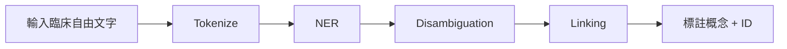

`MedCAT`（**Medical Concept Annotation Toolkit**）是一個專為 **臨床文本理解與資訊抽取** 而設計的 NLP 工具，由英國 NHS（國民保健署）合作團隊 [CogStack](https://github.com/CogStack) 所開發。

🔗 GitHub 專案網址：  
👉 [https://github.com/CogStack/MedCAT](https://github.com/CogStack/MedCAT)

---

## 🧠 MedCAT 是什麼？

`MedCAT` 是一個開源的 **臨床命名實體識別（NER）與實體連結（Entity Linking, EL）** 工具，目的是從未結構化的臨床文本（如病歷、醫療報告）中，自動辨識並標註「醫療概念」，並**連結到知識圖譜**（如 SNOMED CT、UMLS）。

它整合了以下功能：

1. **NER：** 辨識臨床文本中的醫療術語，如疾病、藥物、檢查等。
2. **Entity Linking：** 將辨識出的文字對應到標準醫學語彙系統的唯一ID（e.g., SNOMED CT Concept ID）。
3. **Concept Disambiguation：** 同字詞但不同概念的自動判斷。
4. **Spelling Correction、Abbreviation Resolution：** 支援拼字修正與醫療縮寫展開。

---

## 📦 功能亮點

| 功能                             | 說明 |
|----------------------------------|------|
| 🔎 NER + EL                      | 自動抽取醫療術語並對應至知識庫 |
| 📚 支援多種 ontology            | 預設支援 SNOMED CT，也可自訂 UMLS、ICD 等 |
| 🧠 支援深度學習語言模型         | 採用 **word embeddings + context vectors** |
| 🏷️ 支援訓練自己的標註資料集     | 可使用訓練 UI（MedCAT Trainer）自行微調 |
| 🌐 REST API + Web UI            | 附帶 web 介面可標註資料、進行有監督學習 |
| 🔀 支援 Negation / Temporality / Meta-annotations | 可辨識是否是否定詞（如 no pain）或時間屬性（如曾經、現在） |

---

## 🏥 使用場景

適用於處理 **臨床文本/電子病歷（EHR）**，如：

- 醫療實體抽取（病名、藥品、檢查項目等）
- 病歷摘要標註與結構化
- ICD 或 SNOMED 編碼預測
- 醫院內部自然語言分析（如讀取率預測、臨床研究資料前處理）

---

## 🔧 技術架構與工作流程



內部核心為：

- **SpaCy** 為 NLP pipeline 基礎
- 自建詞彙向量模型 + context disambiguation classifier
- 支援 semi-supervised 或 supervised 學習來 fine-tune 使用者定義概念
- 可搭配 MedCAT Trainer（Web GUI）進行標註資料微調模型

---

## 🛠️ 安裝與基本使用

### 1. 安裝

```bash
pip install medcat
```

也可安裝完整套件（包含 UI）：

```bash
pip install medcat[all]
```

### 2. 預訓練模型載入與標註範例

```python
from medcat.cat import CAT
from medcat.cdb import CDB
from medcat.vocab import Vocab

cdb = CDB.load("models/cdb.dat")     # 概念資料庫
vocab = Vocab.load("models/vocab.dat")  # 詞彙向量模型
cat = CAT(cdb=cdb, vocab=vocab)

result = cat.get_entities("The patient has diabetes and hypertension.")
print(result)
```

---

## 📁 專案結構重點

- `medcat/`: 主程式庫，包括 CDB（Concept DB）、Vocab、NER 模組、embedding 模型等。
- `medcat_trainer/`: Web 標註介面，可用來建立有標記資料、自訓練模型。
- `models/`: 常用預訓練模型，如 SNOMED 對應模型。
- `examples/`: 示範如何應用模型進行 NER + Linking。

---

## 📚 相關文獻

> **Kraljevic, Zeljko, et al.**  
> *"MedCAT: Medical Concept Annotation Toolkit."*  
> Artificial Intelligence in Medicine (2021).  
> DOI: [10.1016/j.artmed.2021.102132](https://doi.org/10.1016/j.artmed.2021.102132)

---

## ✅ 優點與應用建議

| 優點                                 | 說明 |
|--------------------------------------|------|
| 針對醫療文本最佳化                   | 不需自建知識圖譜，直接搭配 SNOMED/UMLS |
| 可自行訓練與擴展                     | 內建訓練工具，利於客製化、企業內部部署 |
| 整合 NLP pipeline + Ontology linking | 相較 spaCy + 自建工具鏈更易上手 |
| 適合大規模醫療資料標註               | 適用臨床 NLP、病歷結構化等任務 |

---

## 🧩 MedCAT vs clinicalBERT

| 項目               | `MedCAT`                                       | `clinicalBERT`                                   |
|--------------------|------------------------------------------------|--------------------------------------------------|
| 核心目標           | 實體辨識 + 概念連結                            | 通用語言表示（用於分類、預測等）                |
| 運作方式           | NER + Linking（知識圖譜為主）                  | Transformer-based contextual embedding          |
| 可否自訓練         | ✅ 有 web-based 標註工具                       | ❌（需自己改 tokenizer / fine-tune）            |
| 是否需要語料預訓練 | ❌（可直接使用預訓練模型）                     | ✅（需有醫療語料，如 MIMIC-III）                |
| 適合任務           | 病名抽取、ICD編碼、EHR結構化                   | 預測模型、分類任務、文本表示                    |

—

## 💡 使用建議（若你是企業開發者）

若你正在開發以下應用：

- 電子病歷（EHR）轉結構化資料
- 病人自述（症狀）自動標註為標準疾病/檢查項目
- 醫療知識圖譜建構
- 建立醫療AI模型前的前處理

則 MedCAT 是非常強大的開源工具。你可使用內建的模型進行快速部署，或透過 `medcat_trainer` 建立符合你場域（如中文病歷、自有醫療術語庫）的客製模型。

---

若你有打算在中文醫療場景打造類似工具，我也可以協助你用類似架構搭配醫療知識庫（如 SNOMED CT 中文版、ICD-10-CM 中文版）來設計一個中文版本的 MedCAT 系統。需要我幫你設計請隨時告訴我。